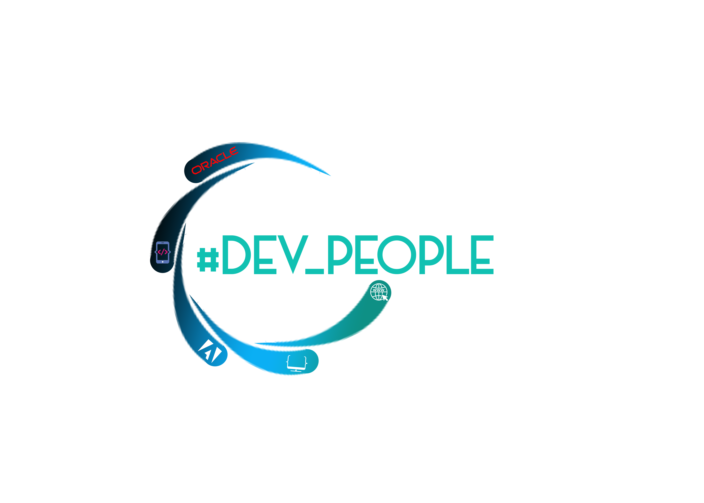

<h1 align="center" style="color: #3ec2ae">
    I-Recycle, by #DEV_PEOPLE
</h1>

<ul>
    <li><h2><code>composer install or composer update</code></h2></li>
    <li><h2>créer un fichier .env dont le contenu se trouve ci-dessous (Adapter en fonction de votre environnement)</h2></li>
    <li><h2><code>php artisan migrate</code></h2></li>
    <li><h2><code>php artisan passport:install</code></h2></li>
    <li><h2><code>php artisan l5-swagger:generate</code></h2></li>
</ul>

<h2>Contenu du env</h2>

<h3>

APP_NAME="I-Recycle"
APP_ENV=local
APP_KEY=base64:QmXdSunsBEErknWA13VbjJjXhIFDfvpEsSDh1Dmmqhk=
APP_DEBUG=true
APP_URL=http://irecycle-api.test

LOG_CHANNEL=stack
LOG_DEPRECATIONS_CHANNEL=null
LOG_LEVEL=debug

DB_CONNECTION=mysql
DB_HOST=127.0.0.1
DB_PORT=3306
DB_DATABASE=irecycle
DB_USERNAME=root
DB_PASSWORD=

BROADCAST_DRIVER=log
CACHE_DRIVER=file
FILESYSTEM_DRIVER=local
QUEUE_CONNECTION=sync
SESSION_DRIVER=file
SESSION_LIFETIME=120

MEMCACHED_HOST=127.0.0.1

REDIS_HOST=127.0.0.1
REDIS_PASSWORD=null
REDIS_PORT=6379

MAIL_MAILER=smtp
MAIL_HOST=mailhog
MAIL_PORT=1025
MAIL_USERNAME=null
MAIL_PASSWORD=null
MAIL_ENCRYPTION=null
MAIL_FROM_ADDRESS=null
MAIL_FROM_NAME="${APP_NAME}"

AWS_ACCESS_KEY_ID=
AWS_SECRET_ACCESS_KEY=
AWS_DEFAULT_REGION=us-east-1
AWS_BUCKET=
AWS_USE_PATH_STYLE_ENDPOINT=false

PUSHER_APP_ID=
PUSHER_APP_KEY=
PUSHER_APP_SECRET=
PUSHER_APP_CLUSTER=mt1

MIX_PUSHER_APP_KEY="${PUSHER_APP_KEY}"
MIX_PUSHER_APP_CLUSTER="${PUSHER_APP_CLUSTER}"

L5_SWAGGER_CONST_HOST="${APP_URL}/api"

</h3>
